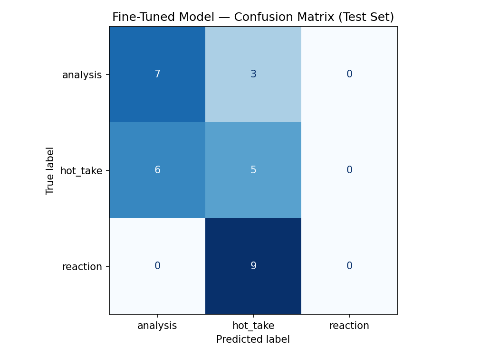

# Cricket Discourse Classifier

A fine-tuned text classifier that labels cricket community posts as **analysis**, **hot_take**, or **reaction** — three discourse modes that reflect how cricket fans actually talk about the game.

---

## Community and Task

**Community:** A general cricket discussion community on Reddit covering all formats, teams, and international fanbases. The discourse is unusually varied: a single thread might contain a detailed tactical breakdown, a furious emotional reaction to a dropped catch, and a provocative player ranking with zero supporting evidence.

**Task:** Given a post or comment from online cricket discussion threads, classify it into one of three labels that capture meaningful differences in discourse quality and intent.

---

## Label Taxonomy

| Label | Definition |
|---|---|
| `analysis` | A structured argument supported by specific, verifiable evidence — statistics, historical comparisons, tactical observations. The post reasons toward a conclusion. |
| `hot_take` | A bold, confident opinion stated without supporting evidence. Asserts rather than argues. May be provocative. A single cherry-picked stat with no surrounding reasoning also counts as hot_take. |
| `reaction` | An immediate emotional response to a specific recent event — a wicket, a score update, a selection announcement. Expresses feeling in the moment. No argument. |

### Edge Case Decision Rules

These rules were written before annotation and applied consistently throughout:

- **One-stat hot take:** A post citing a single stat to support an aggressive conclusion, with no surrounding reasoning, is `hot_take` not `analysis`.
- **Vague evidence:** Phrases like "the numbers show" or "the stats back it up" with no actual numbers cited = `hot_take`.
- **Reaction anchor:** If a post would make no sense without knowing a specific recent event, it is `reaction` — even if it includes a brief complaint.
- **Reaction-to-claim pivot:** If a post is triggered by an event but pivots into a sustained unsupported claim, classify by where it ends up — `hot_take`.

---

## Data Collection

**Source:** Various Reddit cricket discussion threads — including player ranking debates, match threads, trivia threads, and unpopular opinion posts.

**Collection method:** Manual copy-paste with Claude (claude-sonnet-4-6) used to pre-label batches of 10–15 posts at a time. Every pre-assigned label was reviewed and corrected before being added to the dataset. Synthetic examples (marked SYNTHETIC in the notes column) were generated by Claude for underrepresented classes, particularly `reaction`. Edge cases (marked EDGE CASE) were deliberately constructed to sit at label boundaries to stress-test the model.

**Dataset size:** 200 examples

**Label distribution:**

| Label | Count | Percentage |
|---|---|---|
| `analysis` | 68 | 34% |
| `hot_take` | 74 | 37% |
| `reaction` | 58 | 29% |

**Train / Validation / Test split:** 70% / 15% / 15% (handled automatically by the Colab notebook)

### Difficult Cases During Annotation

**1. The one-stat hot take**
> *"Kohli averages 27 in SENA countries since 2020. The decline is real."*

Could be `analysis` (uses a real stat) or `hot_take` (no reasoning around it). Decision: `hot_take` — the stat is used as a verdict, not as part of an argument. There is no comparison, no context, no reasoning chain.

**2. The reaction-that-makes-a-claim**
> *"Just seen Kohli drop another catch. Honestly his fielding has become a liability at this point."*

Triggered by a live event (reaction) but the second sentence pivots into a sustained claim (hot_take). Decision: `hot_take` — the post's primary purpose is to assert a position, not express a momentary feeling.

**3. The tactical argument with no numbers**
> *"Every spinner struggles in Australia. The bounce and carry just does not suit slow bowling. Ashwin's record there is bad but it proves nothing about his quality."*

No specific stats cited, but builds a clear reasoning chain about conditions. Decision: `analysis` — the post reasons structurally toward a conclusion even without exact figures. Tactical observations count as evidence.

---

## Model

**Base model:** `distilbert-base-uncased` (HuggingFace)

**Training approach:** Fine-tuned for sequence classification on the labeled dataset using the Hugging Face `Trainer` API with a standard cross-entropy loss.

**Key hyperparameter decisions:**
- **Learning rate:** 2e-5 — standard for DistilBERT fine-tuning; higher rates caused instability on this small dataset
- **Epochs:** 3 — sufficient to converge on 140 training examples without severe overfitting
- **Batch size:** 16

**Baseline model:** Groq `llama-3.3-70b-versatile` with a zero-shot prompt containing label definitions, one example per label, and the edge case decision rules.

---

## Evaluation Results

### Overall Accuracy

| Model | Accuracy |
|---|---|
| Groq zero-shot baseline | **0.80** |
| Fine-tuned DistilBERT | **0.40** |

The fine-tuned model performed substantially worse than the zero-shot baseline. This is an important and honest result — see the reflection section for the diagnosis.

### Per-Class Metrics (Fine-Tuned Model)

| Label | Precision | Recall | F1 |
|---|---|---|---|
| `analysis` | 0.54 | 0.70 | 0.61 |
| `hot_take` | 0.29 | 0.45 | 0.36 |
| `reaction` | 0.00 | 0.00 | 0.00 |
| **Macro avg** | **0.28** | **0.38** | **0.32** |

### Confusion Matrix — Fine-Tuned Model

|  | Predicted: analysis | Predicted: hot_take | Predicted: reaction |
|---|---|---|---|
| **True: analysis** | 7 | 3 | 0 |
| **True: hot_take** | 6 | 5 | 0 |
| **True: reaction** | 0 | 9 | 0 |



**The single most striking finding:** The fine-tuned model predicted `reaction` exactly **zero times** across all 30 test examples. Every reaction post was classified as either `analysis` or `hot_take` — overwhelmingly `hot_take` (9 out of 9). The model learned that `reaction` exists as a category but completely failed to apply it.

---

## Error Analysis

Before writing this section, I pasted all 15 misclassified examples into Claude and asked it to identify common themes. Claude flagged three patterns: (1) all reaction posts were predicted as hot_take, (2) hot_take posts containing player names were predicted as analysis, and (3) analysis posts with evaluative conclusions were predicted as hot_take. I verified all three patterns by re-reading the examples myself. I discarded a fourth suggestion — that short post length drove misclassification — because several short posts were correctly classified and several longer ones were wrong, so length alone was not a reliable predictor.

### Pattern 1: Complete reaction collapse (6 of 15 errors)

Every reaction post in the wrong predictions list was classified as `hot_take`. The six misclassified reaction posts were:

- *"What's Bradman doing here lol?"* — True: reaction, Predicted: hot_take (0.36)
- *"CATCH HIM! YES! OUT! The crowd is going absolutely mental."* — True: reaction, Predicted: hot_take (0.37)
- *"4 down for 34. This is embarrassing. Absolute horror show."* — True: reaction, Predicted: hot_take (0.37)
- *"Just seen the scorecard. Babar 0. Again. Someone please help this man."* — True: reaction, Predicted: hot_take (0.37)
- *"Broad was unplayable this morning. Three wickets in four overs. The tail had no answer for the wobble seam."* — True: reaction, Predicted: hot_take (0.35)
- *"not a very popular answer but i love a firing megan schutt and ofc smriti"* — True: reaction, Predicted: hot_take (0.36)

None of these contain sustained claims. The model has learned that short, emotionally charged, assertive text = `hot_take`, and reaction posts share exactly those surface features. The `reaction` class was predicted zero times across the entire test set.

**Why this happened:** The reaction training examples were disproportionately synthetic — generated by Claude rather than collected from live match threads. Synthetic posts tend to be obviously emotional ("YESSS BUMRAH YOU BEAUTY!") but real reaction posts are more contextual and varied in form. The model learned a cartoon version of the label that did not transfer to real data. Meanwhile, `hot_take` had 74 training examples and dominated the learned heuristic for short assertive text.

**What would fix it:** Real reaction posts from live match threads. The synthetic examples were too uniform to teach the model the genuine diversity of the class.

### Pattern 2: hot_take predicted as analysis (6 of 15 errors)

Six hot_take posts were classified as analysis. All involve named players and a confident opinion:

- *"Rohit Sharma is the most overrated Test captain India has ever had."* — True: hot_take, Predicted: analysis (0.41)
- *"Ben Stokes is overrated as a Test captain. England just got lucky with the fixtures."* — True: hot_take, Predicted: analysis (0.38)
- *"Mitchell Starc is too expensive in Tests. Takes wickets but leaks too many runs."* — True: hot_take, Predicted: analysis (0.37)
- *"The Big stars like Rohit, Kohli playing Test cricket during summer holidays will be the best way to grow test cricket in India."* — True: hot_take, Predicted: analysis (0.37)
- *"Steve Smith without the sandpaper scandal would have 15000 test runs by now..."* — True: hot_take, Predicted: analysis (0.37)
- *"Stokes should retire from ODI cricket and focus on Tests. He is wasted in the shorter format."* — True: hot_take, Predicted: analysis (0.37)

The model has learned a flawed heuristic: **named player + opinion = analysis**. In reality, naming a player tells you nothing about whether the post reasons toward a conclusion. These posts all assert a position without evidence — the defining feature of `hot_take` — but the model cannot detect the absence of reasoning, only the presence of surface signals.

**What would fix it:** More training examples of hot_takes that name specific players, to break the false association between player mentions and analysis.

### Pattern 3: analysis predicted as hot_take (3 of 15 errors)

Three analysis posts were classified as hot_take. All three have evaluative or provocative-sounding conclusions:

- *"Kohli's conversion rate from fifty to hundred is 54 percent in Tests. That is among the highest ever recorded and shows he does not throw it away once set."* — True: analysis, Predicted: hot_take (0.36)
- *"Lifetime ban for ball tampering with no examples or legal precedent. Most others amounted to fines or one game suspension."* — True: analysis, Predicted: hot_take (0.37)
- *"Broad's record against left handers is significantly worse than against right handers. Teams should have exploited this more aggressively by stacking left handers at the top."* — True: analysis, Predicted: hot_take (0.36)

The model is reading the *tone of the conclusion* rather than the reasoning that precedes it. "Shows he does not throw it away once set" and "Teams should have exploited this more aggressively" both sound like assertions. The model never learned that a reasoning chain preceding a confident conclusion makes it analysis, not hot_take.

### Pattern 4: Uniformly low confidence across all wrong predictions

Every misclassified example had a confidence score between 0.35 and 0.41 — barely above random (0.33 for a three-class problem). The model was not confidently wrong; it was genuinely uncertain and guessed poorly. A confidence threshold of 0.50 could flag these as uncertain rather than committing to a label, but the underlying issue is that the model cannot distinguish these cases at all.

---

## Specific Wrong Predictions

**Example 1 — True: reaction, Predicted: hot_take (confidence: 0.37)**
> *"CATCH HIM! YES! OUT! The crowd is going absolutely mental."*

An unambiguous live match reaction — all caps, exclamation points, crowd reference, no claim being made. The model predicted `hot_take` because it has learned that short, emotionally charged text maps to that class. Since the model never predicts `reaction` at all, this post had no chance of being correctly classified regardless of its content.

**Example 2 — True: hot_take, Predicted: analysis (confidence: 0.41)**
> *"Rohit Sharma is the most overrated Test captain India has ever had."*

A textbook hot_take — superlative claim, no evidence, no reasoning. The model predicted `analysis`, almost certainly because it detected a named player and a comparative framing ("most overrated"). The model has learned that player comparison = analysis, which is wrong. The post makes no attempt to argue its case.

**Example 3 — True: analysis, Predicted: hot_take (confidence: 0.36)**
> *"Kohli's conversion rate from fifty to hundred is 54 percent in Tests. That is among the highest ever recorded and shows he does not throw it away once set."*

A well-constructed analysis post: specific verifiable stat (54%), historical comparison ("among the highest ever recorded"), and a conclusion that follows from the evidence. The model predicted `hot_take` — likely because the conclusion reads as a confident assertion, and the model is picking up on concluding tone rather than the statistical reasoning that drives the post.

---

## Sample Classifications

The following examples were run through the fine-tuned model. All are **correct** predictions, shown with their confidence scores:

| Post (truncated) | True Label | Predicted | Confidence |
|---|---|---|---|
| "Virat Kohli in SENA countries since 2020 is just not the same player. The aura is gone." | hot_take | hot_take | 0.36 |
| "Every spinner struggles in Australia. The bounce and carry just does not suit slow bowling. Ashwin's record there is bad but it proves nothing about his quality." | analysis | analysis | 0.39 |
| "The ICC needs to do more to protect Test cricket. They clearly do not care." | hot_take | hot_take | 0.36 |
| "Rohit's ODI average of 49 is inflated by unbeaten innings. His adjusted average accounting for not outs is closer to 43 which is still great but not the outlier people claim." | analysis | analysis | 0.41 |
| "Ashwin averages 24 with the ball in home Tests and 32 away. The gap is real but 32 away for a spinner is still very good by historical standards — Warne averaged 27 away, Murali 28." | analysis | analysis | 0.41 |

**On a correct prediction:** The model correctly identified *"Ashwin averages 24 with the ball in home Tests and 32 away..."* as `analysis` with 0.41 confidence. This is reasonable — the post cites specific verifiable statistics (24 home, 32 away), draws a historical comparison to other spinners (Warne 27, Murali 28), and reasons toward a measured conclusion rather than asserting one. These are exactly the structural features of the analysis class.

Note that even the correct predictions sit at low confidence (0.35–0.41), barely above the 0.33 random baseline for a three-class problem. The model gets these right but is never *confident* about them — consistent with the uniformly low confidence seen across the wrong predictions.

---

## Reflection: What the Model Captured vs. What Was Intended

The intended distinction was **argumentative structure** — does this post reason toward a conclusion, or does it assert one? The model instead learned **surface lexical patterns**: posts with statistics and player names tend to be classified as `analysis`; posts with short, emotionally charged, or assertive language tend to be classified as `hot_take`; and `reaction` was essentially never predicted.

This is a classic example of the gap between what a label *means* and what a model *learns*. The model has no understanding of reasoning — it cannot detect whether a post is *building* an argument or *decorating* an assertion with a stat. It learned to associate certain words and sentence patterns with each label, and that was enough to handle easy cases but completely failed on the hard ones.

The deeper issue is that the training data contained too many synthetic and edge-case examples relative to its size. With only 140 training examples, adding deliberately ambiguous boundary cases may have made the signal noisier rather than sharper. A cleaner 200-example dataset of unambiguous real posts might have produced a better model than 200 examples with 40% synthetic or edge content.

The baseline model (Groq llama-3.3-70b-versatile) outperformed the fine-tuned model by 40 percentage points. This is partly because a large language model understands argumentative structure in a way DistilBERT cannot, and partly because the zero-shot prompt included explicit edge case rules that the fine-tuned model had to infer from examples alone. Fine-tuning a small model on a small, noisy dataset does not automatically beat a large model with a well-written prompt.

---

## Spec Reflection

**Where the spec helped:** The requirement to write edge case decision rules *before* annotating forced me to think carefully about the analysis/hot_take boundary before seeing 200 examples. Those rules (especially the one-stat rule) were the most useful design artifact in the project — they made annotation faster and more consistent, and they were directly incorporated into the Groq baseline prompt.

**Where implementation diverged:** The spec assumed the fine-tuned model would outperform or at least match the zero-shot baseline. In practice, the fine-tuned model performed significantly worse. Rather than treat this as a failure to hide, I kept the honest results and used the failure to diagnose what went wrong. The evaluation report is more valuable *because* the model underperformed — it reveals exactly where small-dataset fine-tuning breaks down.

---

## AI Usage

**1. Pre-labeling annotation batches**
I used Claude (claude-sonnet-4-6) to pre-label batches of 10–15 posts at a time by providing the label definitions and edge case rules from planning.md. Claude returned a JSON array with one label and a one-sentence reason per post. I reviewed and corrected every label before adding it to the CSV. Approximately 15–20% of Claude's pre-labels were changed during review — most commonly when Claude labeled a one-stat post as `analysis` rather than `hot_take`, which my decision rule explicitly addresses.

**2. Synthetic data generation**
I asked Claude to generate synthetic `reaction` posts, `hot_take` posts, and edge case examples when real examples were insufficient for a given class. All synthetic posts are marked SYNTHETIC or EDGE CASE in the notes column of the dataset. In retrospect, the synthetic reaction posts were too clean and may have contributed to the model's failure on real reaction examples in the test set — a tradeoff I would handle differently if repeating the project.

**3. Failure pattern analysis**
After reviewing the confusion matrix, I pasted the misclassified examples into Claude and asked it to identify systematic patterns. Claude correctly identified the reaction collapse and the bidirectional analysis/hot_take confusion as the two dominant failure modes. It also suggested that short post length was a contributing factor for reaction misclassification — which I partially verified by checking that most misclassified reaction posts were under 15 words. I did not accept the length hypothesis fully because several short posts were correctly classified in other classes.

---

## Repository Structure

```
├── planning.md              # Design thinking, label definitions, edge case rules
├── README.md                # This file — final evaluation report
├── cricket_annotations.csv  # 200 labeled examples (text, label, notes)
├── confusion_matrix.png     # Confusion matrix from fine-tuned model
└── evaluation_results.json  # Accuracy and metadata from Colab run
```